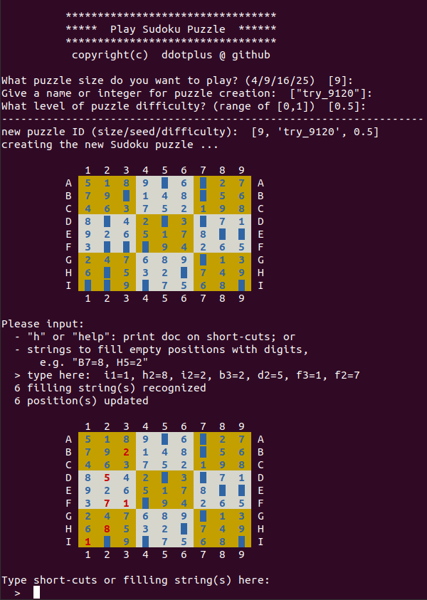

## Play Sudoku Puzzle

Solve Sudoku puzzle in terminal, with automatic generation, hints and solution. Easier to play.


This repo includes generator, solver, and user-play interface for 
Sudoku puzzles:
- **generator**: create a series of reproducible puzzles at 
user-selected difficulty levels, using automatic random seeds 
like 'test_1', 'test_2', 'test_3', and so on.
- **solver**: find all solutions for incomplete array of Sudoku puzzle.
- **user-play interface**: help player solve puzzles in terminal with 
friendly interface, hint indication, solution, and so on. 


This was intended for personal hobby to solve Sudoku. If you are having 
some fun with it, please don't hesitate to leave some suggestions or 
feedbacks. Thanks!

### Features
- **Options to grid size of puzzles**: `4x4`, `9x9`, `16x16`, `25x25`<br> 
(no size limit on puzzle generation, but limit for display or computation)
- **Options to any series of reproducible puzzles**: user-defined 
name string, together with automatic number increment, as random seeds 
to generate reproducible puzzle series.
- **Options to fine difficulty levels**: continuous levels ranging from 0 to 1, 
defined by user
- **Friendly interface for player**: case-insensitive input, with colors, hints, solution, etc.

### Play in terminal



- `help` doc
```txt
    --------------------------------------------------
     List all short-cuts:
       h:  print this help
       hN:  show next N hints (random)
       ha:  show all hints
       c:  show current status
       r:  restart current puzzle
       s:  show final solution
       n:  start a new puzzle
       q:  quit the game
    --------------------------------------------------
     Format of position filling string(s):
       "VH=D"  (multiple strings separated by ",")
       "V"  --  vertical index of an empty position
       "H"  --  horizontal index of an empty position
       "D"  --  digits to be filled
       All blank spaces ignored, and case insensitive
    --------------------------------------------------
```

### How to run
In Unix / Linux terminal:
```shell
$ python3 sudoku_play.py
```
It was tested under `Python 3.8.10`.

### Functions
- For generator:
  - see functions in `sudoku_generator.py`; and 
  - wrapper function `gen_customized_puzzle()` in `sudoku_play.py`
- For solver:
  - `solve_sudoku()` in `sudoku_utility.py`
- For interface:
  - `display()` in `sudoku_utility.py`
  - `main_sudoku_play()` in `sudoku_play.py`

### MIT License

Copyright (c) 2024 ddotplus@github
